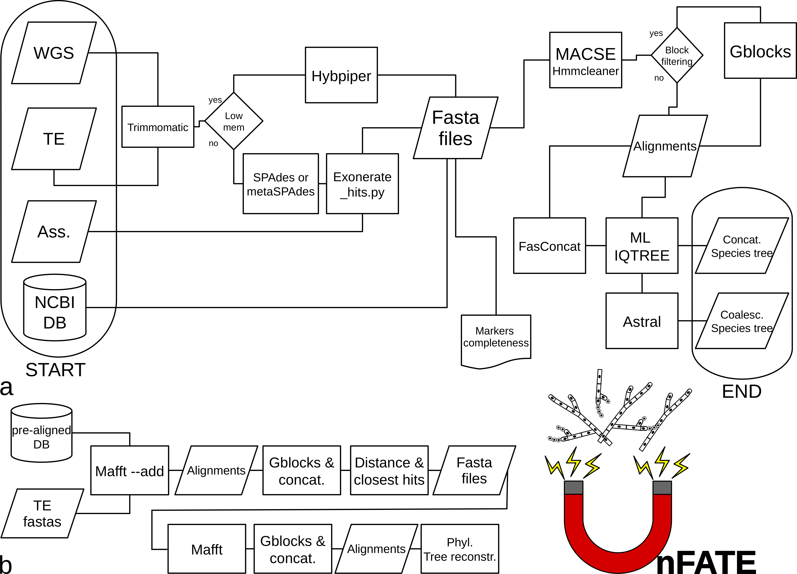

# UnFATE 

#### Universal Filamentous Ascomycetes Target Enrichment bait set and wrapper script for phylogenetics and genome-based barcoding

The wrapper script is designed to be easy to use and to provide a fast way from target enrichment data, assemblies, and/or whole genome sequence to phylogenetic trees.

In order to avoid the installation of dependencies and external software, that often lead to problems for inexperienced users (...well, not only for them), most of the software needed by UnFATE is already included in this repository, therefore, you should acknowledge their work by citing them (see below)!

## Workflow
                                                                                                                                                                           
1. Data from:  Target enrichment sequencing, Whole genome sequencing and Assemblies.  
**Representative sequences** used to build the bait set (included in the repository: UnFATE_markers_195.fas)  

2. **Exonerate 2.2.0** and exonerate_hits.py script from Hybpiper to mine genes from assemblies using the amino acid  representative sequences fasta file (the best reference sequence is selected by BLAST)
                              
3. **Trimmomatic 0.39** to trim Illumina paired reads .fastq.gz from TE or WGS 

4. **HybPiper 1.3.1** or **Spades/Metspades 3.0.13** plus **Exonerate 2.2.0** to extract the markers from target enrichment, WGS, or assemblies.

5. Fasta files are built from retrieved markers, eventually adding the markers from the pre-mined database of NCBI assemblies included in UnFATE repository (if you plan to use it, make sure you download the repository from the browser interface, or install the Github large file storage system before you git clone UnFATE)

6. **MACSE2.03** pipeline **OMM_MACSE10.02** to perform codon-aware alignment and segment-based filtering **(HMMcleaner 1.8)**

7. **Gblocks 0.91b** or **TrimAl 1.4**  to add an optional second block-based filtering step

8. **IQ-TREE 2** is used for single locus phylogenetic inference

9. **FASconCAT-G_v1.04** is used to concatenate single marker alignments into a supermatrix

10. **IQ-TREE 2** is used for the supermatrix phylogenetic inference

11. **ASTRAL 5.7.7** is used to build the species tree from single locus trees

12. Optionally run **Phyparts** to get species tree nodal conflict assessment
  
## Installation and use
Prerequisites/Dependencies: 
* A working Linux operating system (testing and development were done on various versions of Ubuntu, but other Linux distributions should work), as the main OS or as a virual machine.
* Only for Windows users: Activate the Windows 10 linux subsystem, enable developer tools and install Ubuntu 20.04 LTS from the Microsoft store (many guides are available online to get this done!). This mode of use is NOT tested.
* GNU Parallel (usually preinstalled in Linux)
* Anaconda 
  *  Download and install the Anaconda installer for Linux: https://docs.anaconda.com/anaconda/install/linux/
  * `bash ~/path/to/Anaconda3-2020.02-Linux-x86_64.sh`
  * Answer "yes" to conda init
  * Restart Ubuntu, it should show the (base) conda environment at the beginning of your command line
* Create a conda environment which uses Python3.6
  * `conda create -n environment_name python=3.6`
* Start the environment
  *`conda activate environment_name`  
* Install dependencies using conda  
   * `conda install -c bioconda blast spades exonerate hmmer trimal` 
   * `conda install biopython==1.76 pandas seaborn click`
* Install parallel if not already installed
  * `conda install -c conda-forge parallel`   
* Install java if not already installed  
  * `sudo apt-get update`
  * `sudo apt install default-jre`

* Install phypartspiecharts dependencies (if you want to run pie_wrap.py):
   * ete3 and ete_toolchain: `conda install -c etetoolkit ete3 ete_toolchain`, then check installation with `ete3 build check`

1. Clone the UnFATE repository (or download the .zip file from Github browser interface). Choose a position for the UnFATE folder you like, do not move the repository after the first run (use the argument `--first_use`).
If you need to move the folder, re-run with `--first-run`, but it will be necessary to re-clone the repository.

2. Read the help section of the script to set up the command line for your analysis:  
`python3 main_wrap.py --help`

3. Set up file extensions: Sequencing data must be in files ending in _R(direction).fastq(.gz) or _SE.fastq(.gz). 
Assemblies must be in fasta files ending in .fna(.gz).

4. Run UnFATE using the command line. For example:
`python3 main_wrap.py -b ~/path/to/protein/fasta/UnFATE_markers_195.fas -t ~/path/to/target_enrichment/ -a ~/path/to/assemblies/ --c 8 -n Tuber Morchella -f -o ~/path/to/output/`

  * Consider running the script from a "tmux" detachable session, as the run can be very long, according to how many samples you have (this tools is usually preinstalled in Linux). Analyses with hundreds of samples should be run on high core number machines!  
  * Consider logging the script output with `python3 main_wrap.py {params} |& tee <logfile>`. This saves the stdout and stderr from running main_wrap.py into \<logfile\> as well as printing it to the console.
  * The pre-mined NCBI database is accessed with the `-n` argument. You can select any taxonomic rank included in Accession_plus_taxonomy_Pezizomycotina.txt. If you want to select a binomial species name, remember to put a backslash before the blank    (e.g. Fuffaria\ fuffolosa). If you add AUTO to the list of groups you want, main_wrap.py will use a similar method to barcode_wrap to find the closest samples in the database. Up to 10 additional samples per user sample can be added to the dataset.
  * Although the script was written with our bait set in mind, it should work with any amino acid target file in the format required by HybPiper. If using an external file, the pre-mined NCBI data will not be helpful.
  * There are two ways to reduce the memory requirements and CPU burden of UnFATE depending on your input data. If you are supplying whole genome data, you can use the `-l` flag to run HybPiper instead of spades, then exonerate. This greatly reduces memory requirements and calculation time. If you are supplying assemblies, or can assemble whole genome data but have trouble running exonerate (look for "Killed" in the output), use `-m <memory in GB>` to reduce the memory used by exonerate. Memory usage can't be strictly limited to the specified value unfortunately, so you will want to set the value below your actual limit.
  * If you wish to use HybPiper to capture sequences from your target enrichment reads, use the `-y` flag. This is kept seperate from the low memory flag which causes HybPiper to be used for WGS data, as assembly of reads from target enrichment is not nearly as memory intensive as assembling a whole genome.

5.  Cross your fingers and wait, good luck!  ...Take into account that the script parallelizes using the `--cpu n` you specify as an argument, HybPiper and Exonerate will process n samples at a time. The same number of cpu is then used to parallelize IQ-TREE runs for single locus trees and for concatenated supermatrices (only if that many cores are needed).  

6. A run can be resumed if the script is terminated before generating trees, but after generating supermatrices. This will happen automatically if the output directory contains the assemblies/ and/or target_enrichment/, fastas/, macsed_alignments/, and supermatrix/ directories. Please remove any tree directories from the output directory (if present) before resuming to avoid errors.

7. [PhypartsPieCharts](https://github.com/mossmatters/phyloscripts/tree/master/phypartspiecharts) is a nice tool for visualize the nodal conflict level  for the species tree which uses Phyparts. Consider running PhypartsPieCharts through our helper script with `python pie_wrap.py -t /path/to/single_locus_trees/ -p /path/to/species/tree`. You may need to use `ssh -Y` for the script to run properly on a remote device.

## Output description
The UnFATE output will be placed in many folders within the location specified by -o, several output folders will be created corresponding to the pipeline steps:  
* The "target_enrichment" folder will contain symlinks to your supplied target enrichment data, trimmed read files, and the HybPiper or metaSPAdes and exonerate_hits.py analysis folders, one per sample.
* The "whole_genome_data" folder will contain symlinks to your supplied WGS data, trimmed read files, and the HybPiper or SPAdes and exonerate_hits.py analysis folders, one per sample.
* The "assemblies" folder will contain symlinks to your assemblies and the "Exonerate_hits.py" runs folder, one per sample.
* The "fastas" folder will contain DNA and AA fasta files, one per marker of interest, the MACSE runs folders, and summaries of the amount of data that could be captured from your data.
* The "macsed_alignments" folder will contain DNA and AA alignments, aligned and filtered with OMM_MACSE pipeline and (optionally) filtered with TrimAl.
* The "auto_selection" folder will exist if you ran main_wrap with `-n AUTO` and will contain DNA alignments of sequences from your data and the pre-mined database.
* The "single_locus_trees" folder will contain the IQ-TREE phylogenetic analyses on single markers (from both DNA and AA alignments).
* The "supermatrix" folder will contain both the concatenation of the single marker alignments and the IQ-TREE phylogenetic inference (from both DNA and AA alignments).
* The "supertree" folder will contain both the file with the best tree for each marker and the ASTRAL species tree (from both DNA and AA alignments).
* The "final_trees" folder will contain the trees generate from concatenation (IQ-TREE) and coalescence-based approach (ASTRAL) and their version renamed to species name (where NCBI accession numbers were used; e.g. when samples from the precalculated database or assemblies downloaded from NCBI are used).
* The "PhyParts" folder will be made if `pie_wrap.py` is run. The key output is pies.svg, but the full phyparts output will be present as well.
 
## `barcode_wrap.py`
`barcode_wrap.py` is a spinoff of `main_wrap.py`. This script handles multilocus barcoding of target enrichment or WGS data as well as assemblies. It assumes that the input file(s) represent a single species.
`barcode_wrap.py` finds the most closely related samples to the input data in our pre-mined database from NCBI (skipping samples if there are already a configurable number of representatives from its species), then builds a tree of those samples using as many genes as possible (up to 195).
The specificity of the taxonomy inferred from the output trees will depend on the completeness of the pre-mined database. Species level identification could be possible in highly sequenced groups such as Aspergillaceae, but is less likely in groups with few sequenced genomes. 
Specificity will increase as more genomes are added to NCBI and as more organisms are sequenced using our baits.

`barcode_wrap.py` uses the same dependencies as `main_wrap.py`. If you wish to only run `barcode_wrap.py` on a certain machine, the phypartspiecharts dependencies do not need to be installed.
`barcode_wrap.py` is intended to be light enough to run on a desktop computer or laptop, although it will take some time.

A possible usage of `barcode_wrap.py` is to find a closely related group to one of your samples, then run `main_wrap.py` with all of your samples and all members of that group using the `-n <taxon>` argument.
`barcode_wrap.py` does not allow running multiple samples in one run at the moment. If you have multiple samples, consider running `main_wrap.py -n AUTO to get the closest species from the database in your phylogeny`.

The output directories of `barcode_wrap.py` generally mirror the output directories of `main_wrap.py`. The "input" directory contains the raw and trimmed reads supplied, as well as the HybPiper or spades and exonerate output if fastqs are supplied. If an fna is supplied, the contents will be the exonerate results split into multiple parts.
The "fastas" directory contains various forms of the genes extracted from the input added to the pre-mined data. The "final_fastas" directory contains the genes extracted from the input aligned to the genes from the samples selected from the database, ran through Gblocks with relaxed parameters.
The "trees" directory contains the IQ-TREE 2 output from running on the "final_fastas" directory, in addition to a treefile where the accession numbers from NCBI have been replaced with binomials (final_fastas_named.treefile).

## Please cite: 
The wrapper script relies on many great software developed by other people. If you use this wrapper and bait set please cite the applicable papers:

#### UnFATE
Ametrano et al. XXXXXXXXXXXXXXXXXXXXXXXXXXXXXXXXXXXXXXXXXXXXXXXXXXXXXXX

#### Trimmomatic
Bolger, A. M., Lohse, M., & Usadel, B. (2014). Trimmomatic: a flexible trimmer for Illumina sequence data. Bioinformatics, 30(15), 2114-2120.

#### Gblocks
Castresana, J. (2000). Selection of conserved blocks from multiple alignments for their use in phylogenetic analysis. Molecular biology and evolution, 17(4), 540-552.

### TrimAl
Capella-Gutiérrez, S., Silla-Martínez, J. M., & Gabaldón, T. (2009). trimAl: a tool for automated alignment trimming in large-scale phylogenetic analyses. Bioinformatics, 25(15), 1972-1973.

### Hmmercleaner
Di Franco, A., Poujol, R., Baurain, D., & Philippe, H. (2019). Evaluating the usefulness of alignment filtering methods to reduce the impact of errors on evolutionary inferences. BMC evolutionary biology, 19(1), 1-17.

#### FASconCAT-G
Kück, P., & Longo, G. C. (2014). FASconCAT-G: extensive functions for multiple sequence alignment preparations concerning phylogenetic studies. Frontiers in zoology, 11(1), 1-8.

#### IQ-TREE 2
Minh, B. Q., Schmidt, H. A., Chernomor, O., Schrempf, D., Woodhams, M. D., Von Haeseler, A., & Lanfear, R. (2020). IQ-TREE 2: New models and efficient methods for phylogenetic inference in the genomic era. Molecular biology and evolution, 37(5), 1530-1534.

#### MACSE v2
Ranwez, V., Douzery, E. J., Cambon, C., Chantret, N., & Delsuc, F. (2018). MACSE v2: toolkit for the alignment of coding sequences accounting for frameshifts and stop codons. Molecular biology and evolution, 35(10), 2582-2584.

#### Exonerate
Slater, G. S. C., & Birney, E. (2005). Automated generation of heuristics for biological sequence comparison. BMC bioinformatics, 6(1), 1-11.

#### ASTRAL-III
Zhang, Chao, Maryam Rabiee, Erfan Sayyari, and Siavash Mirarab. 2018. “ASTRAL-III: Polynomial Time Species Tree Reconstruction from Partially Resolved Gene Trees.” BMC Bioinformatics 19 (S6): 153.

#### HybPiper
Johnson, M. G., Gardner, E. M., Liu, Y., Medina, R., Goffinet, B., Shaw, A. J., ... & Wickett, N. J. (2016). HybPiper: Extracting coding sequence and introns for phylogenetics from high‐throughput sequencing reads using target enrichment. Applications in plant sciences, 4(7), 1600016.

#### SPAdes
Prjibelski, A., Antipov, D., Meleshko, D., Lapidus, A., Korobeynikov, A. (2020). Using SPAdes De Novo Assembler. Current Protocols in Bioinformatics 70(1), e102.

#### metaSPAdes
Nurk, S., Meleshko, D., Korobeynikov, A., & Pevzner, P. A. (2017). metaSPAdes: a new versatile metagenomic assembler. Genome research 27(5), 824-834.

#### Phyparts
Smith, S. A., Moore, M. J., Brown, J. W., Yang, Y. (2015). Analysis of phylogenomic datasets reveals conflict, concordance, and gene duplications with examples from animals and plants. BMC evolutionary biology 15(1), 1-15

#### Parallel
Tange, O. (2011). Gnu parallel-the command-line power tool. The USENIX Magazine, 36(1), 42-47.
