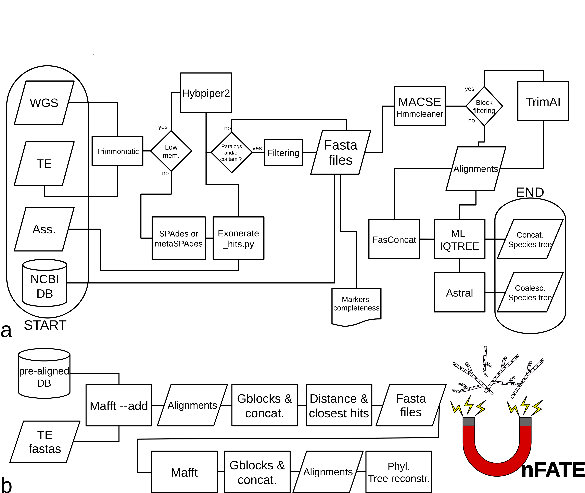

# UnFATE 

## Universal Filamentous Ascomycetes Target Enrichment bait set and wrapper script for phylogenetics and multi-locus barcoding

The wrapper script is designed to be easy to use and to provide a fast way from target enrichment data, assemblies, and/or whole genome sequencing to phylogenetic trees and/or multi-locus barcoding.
If you use the pipline please cite this work and the tools used to build this pipeline (see the section "please cite").

## Workflow
                                                                                                                                                                           

## Installation and use

### With Docker container
1. Download the container ready to be run from Docker Hub
  * `docker pull claudioametrano/unfate1.0:latest`
### OR 
### Build yourself the Docker container 
1. clone UnFATE repository  
  * `git clone https://github.com/claudioametrano/UnFATE.git` 
  Build the docker container (running the Dockerfile which is inside the UnFATE folder, you will not use the rest of the files in the folder, as you will run UnFATE within the container):
  *  `sudo docker build -t unfate1.0:latest  Path/to/UnFATE/folder/`
2. Start the container (interactive)
  *  `sudo docker run -it unfate1.0`
3. Start the UnFATE conda environment within the container
  *  `conda activate unfate`  
4. Quick run (only 10 genes, use the 195 genes protein file for real analyses!) in your current directory with the tutorial dataset (`main_wrap.py --help` for details about the software's arguments):
  *  `wget  https://raw.githubusercontent.com/claudioametrano/UnFATE/master/TUTORIAL_DATASET.tar.gz`
  *  `tar -xf TUTORIAL_DATASET.tar.gz`
  *  `main_wrap.py -b ./TUTORIAL_DATASET/10_Unfate_markers_aa.fasta -a ./TUTORIAL_DATASET/assemb_tutorial/ -w ./TUTORIAL_DATASET/WGS_tutorial/ -t ./TUTORIAL_DATASET/TE_tutorial/ -n Letharia -o ./output_wgs_te_ass_letharia --first_use`
5. Retrieve the output from the container, or copy to the container (while it is still active)
  * `docker cp <container_id>:/path/to/file/on/container /path/on/host`
  * `docker cp /path/on/host <container_id>:/path/to/file/on/container`

### With Conda environment
Prerequisites/Dependencies: 
1. A working Linux operating system (Ubuntu 22.04 LTS and 24.04 LTS were tested; other Linux distributions could work), as the main OS or as a virtual machine (e.g. https://www.linuxvmimages.com/images/ubuntu-2404/).
2.  Download and install the Miniconda installer for Linux: 
  * `wget https://repo.anaconda.com/miniconda/Miniconda3-latest-Linux-x86_64.sh`
  * `bash ./Miniconda3-latest-Linux-x86_64.sh`
  * Answer "yes" to conda init
3. Restart the Terminal, it should show the (base) conda environment at the beginning of your command line
4. Install mamba (all the conda installations will be faster)
  * `conda install conda-forge::mamba`
5. Create a conda environment which uses Python3.7
  * `mamba create -n unfate python=3.11`
6. Start the environment
  * `mamba activate unfate`  
    * `conda config --add channels conda-forge`
    * `conda config --add channels bioconda`  
7. Install dependencies using conda (mamba)
  * `mamba install -c bioconda blast=2.14.1 spades=3.15.5 exonerate=2.4.0 hmmer=3.3.2 trimal=1.4 mafft=7.520` 
  * `mamba install -c conda-forge biopython=1.80`
  * `mamba install pandas=2.1.1 seaborn=0.13.2 click=8.1.7`
  * `mamba install -c conda-forge parallel=20240722`   
8. Install java if not already installed  
  * `mamba install -n unfate --yes -c conda-forge openjdk=22.0.1`
9. Install Hybpiper2
  * `mamba install hybpiper=2.1.8`
10. clone UnFATE repository  
`git clone https://github.com/claudioametrano/UnFATE.git`
11. Quick run (only 10 genes, use the 195 genes protein file for real analyses!) in your current directory with the tutorial dataset (`main_wrap.py --help` for deatails about the software's arguments):
  * `wget  https://raw.githubusercontent.com/claudioametrano/UnFATE/master/TUTORIAL_DATASET.tar.gz`
  * `tar -xf TUTORIAL_DATASET.tar.gz`
  * `python3 ./UnFATE/main_wrap.py -b ./TUTORIAL_DATASET/10_Unfate_markers_aa.fasta -a ./TUTORIAL_DATASET/assemb_tutorial/ -w ./TUTORIAL_DATASET/WGS_tutorial/ -t ./TUTORIAL_DATASET/TE_tutorial/ -n Letharia -o ./output_wgs_te_ass_letharia --first_use`

### main_wrap.py usage example
In the following example main_wrap.py is called from the UnFATE folder using:  
* **-b**: the 195 genes UnFATE reference protein file (**UnFATE_markers_195.fas**) which comes with the UnFATE repository (or any protein file in Hypiper format)
* **-a**: the folder containing asseblies with extension **.fna(.gz)**
* **-w**: the folder containing whole genome sequencing files with extension **_R<1|2>.fastq(.gz)**
* **-t**: the folder containing target enrichment files with extension **_R<1|2>.fastq(.gz)**
* **-n AUTO**: the automatic mode, which picks the samples most similar to your data from the UnFATE database (in addition, any other taxonomic name can be added in a space separated list to the -n argument (see **Accession_plus_taxonomy_Pezizomycotina.txt** in the UnFATE folder), if you use binomial names, put a "\" between genus and species name)
* **-o**: the output folder
* **--cpu**: the number of cores to be used to parallelize the analyses
* **--first_use**: argument to be used only the first time UnFATE is used (do not move the folder afterwards)
* **--trimal**: the block filtering approach is used to remove badly aligned blocks in the alignment
* **--strict_filtering**: any multiple copy gene that is not solved by coverage is discarded from the sample
* **--depth_multiplier 10**: to be retained a copy must have at least 10 times the coverage of the other copies
* **--gappy_out 90**: the samples with >= 90% of missing genes are discarded

`python3 ./UnFATE/main_wrap.py -b ./UnFATE/UnFATE_markers_195.fas -a ./assembly_folder -w ./WGS_folder/ -t ./target_enrichment_folder/ -n AUTO -o ./output_example --cpu 4 --first_use --trimal --strict_filtering --depth_multiplier 10 --gappy_out 90`

### Output description
The UnFATE output will be placed in many folders within the location specified by -o, several output folders will be created corresponding to the pipeline steps:  
* The "target_enrichment" folder will contain symlinks to your supplied target enrichment data, trimmed read files, and the HybPiper or metaSPAdes and exonerate_hits.py analysis folders, one per sample.
* The "whole_genome_data" folder will contain symlinks to your supplied WGS data, trimmed read files, and the HybPiper or SPAdes and exonerate_hits.py analysis folders, one per sample.
* The "assemblies" folder will contain symlinks to your assemblies and the "Exonerate_hits.py" runs folder, one per sample.
* The "fastas" folder will contain DNA and AA fasta files, one per marker of interest, the MACSE runs folders, and summaries of the amount of genes retrieved from your data (**gene_lengths_normalized_heatmap.pdf, gene_lengths.csv, gene_lengths_normalized.csv**).
* The "macsed_alignments" folder will contain DNA and AA alignments, aligned and filtered with OMM_MACSE pipeline and (optionally) filtered with TrimAl.
* The "auto_selection" folder will exist if you ran main_wrap with `-n AUTO` and will contain DNA alignments of sequences from your data and the pre-mined database.
* The "single_locus_trees" folder will contain the IQ-TREE phylogenetic analyses on single markers (from both DNA and AA alignments).
* The "supermatrix" folder will contain both the concatenation of the single marker alignments and the IQ-TREE phylogenetic inference (from both DNA and AA alignments).
* The "supertree" folder will contain both the file with the best tree for each marker and the ASTRAL species tree (from both DNA and AA alignments).
* The "final_trees" folder will contain the trees generate from concatenation and IQ-TREE (**".treefile"**) and coalescence-based approach with ASTRAL (**".tree"**), and their version renamed to species name (**"*_SPECIES_NAME.tre"**, where NCBI accession numbers were used; e.g. when samples from the database or assemblies from NCBI are used).
* The "PhyParts" folder will be made if `pie_wrap.py` is run. The main output is pies.svg, but the full phyparts output will be present.

## barcode_wrap.py usage
`barcode_wrap.py --help` will open the help describing each arumgent and their usage.
* launch the barcode pipeline on a single sample:

`barcode_wrap.py -i TUTORIAL_DATASET/TE_tutorial/GCA_000143535_TE_R* -c 4 -b UnFATE/UnFATE_markers_195.fas -o GCA_00014`

* This script handles **multilocus barcoding** of target enrichment, WGS data and assemblies.
* It finds the most similar samples to the input data in our database, then builds a tree of those samples using the 195 UnFATe genes. The precision of the taxonomy inferred depends on the completeness of the database. Species level identification could be possible in highly sequenced groups (e.g. Aspergillaceae) but it will not be the case in groups with few sequenced genomes.
* A possible usage of `barcode_wrap.py` is to find a closely related group to one of your samples, then run `main_wrap.py` with all of your samples and all members of that group using the `-n <taxon>` argument.
* `barcode_wrap.py` handles one sample at a time at the moment. However, if you have multiple samples, consider running `main_wrap.py -n AUTO` to get the closest samples from the database in your phylogeny`.
* The output structure of `barcode_wrap.py` is similar to `main_wrap.py`. The "input" directory contains the raw and trimmed reads supplied, as well as the HybPiper or Spades and Exonerate output, if fastqs are supplied. If an assembly is supplied, the contents will be the Exonerate results split into multiple parts.
* The "fastas" directory contains the genes extracted from the input sample added to the database-extracted data. The "final_fastas" directory contains the genes extracted from the input aligned to the genes from the samples selected from the database, ran through Gblocks with relaxed parameters.
* The "trees" directory contains the IQ-TREE2 output from running on the "final_fastas" directory, in addition to a treefile where the accession numbers from NCBI have been replaced with binomials (**final_fastas_named.treefile**).

### Run Phyparts and phypartspiecharts.py with the pie_wrap.py helper scripts **(Optional)**
* Create a dedicated enviroment  
  * `mamba create -n phyparts python=3.9.12`
  * `mamba activate phyparts`
* Install phypartspiecharts dependencies
  * `mamba install -c cyclus java-jre=8.45.14` 
  * `mamba install -c bioconda blast=2.12.0 diamond=0.9.21`
  * `mamba install -c etetoolkit ete3=3.1.3`
  * `mamba install -c conda-forge matplotlib=3.8.4`
 

## NOTES
* **UnFATE_markers_195.fas** is the reference file with the amino-acid reference sequences used for our bait set, you should use it to run UnFATE, it can be complemented with additional sequence if you already have sequences from your taxon of interest, this could improve the gene completeness.
* `python3 main_wrap.py --help` will open the help describing each arumgent and their usage.
* the argument **--first_use** only need to be used the first time the pipeline is launched. Do not move the UnFATE folder afterwards. 
* Rememeber to set up file extensions for your data: Sequencing data must be in files ending with **_R<1|2>.fastq(.gz)** or _SE.fastq(.gz). Assemblies must be in fasta files ending with **.fna(.gz)**.
* **TUTORIAL_DATASET.tar.gz**:  This reduced dataset and reference sequences file only uses 10 UnFATE genes, assemblies file which only contain the target genes, TE and WGS fastq artificially generated from the same reduced assemblies. Its olny purpose is to test the UnFATE pipeline. Please check intermediate results, such as the heatmap in the "fastas" folder (**gene_lengths_normalized_heatmap.pdf**). Check also the "final_trees" folder, which should contain a very simple phylogeny containing 17 tips (one sample each of the main Pezizomycotina class from the assemblies, and the same samples from simulated WGS or TE data) plus two _Letharia_ tips from the UnFATE database. For a more computationally intensive test run, wich uses real (downsampled) data, run the content of **TEST_Data_final.tar.gz** (Running time on 10 Xeon E5-2697v3 cores is about 11').
* Consider running the script from a "tmux" or detachable session
* Consider logging the script output with `python3 main_wrap.py {params} |& tee <logfile>`. This saves the stdout and stderr from the running main_wrap.py into \<logfile\> as well as printing it to the console.
* The pre-mined UnFATE database  (`-n` argument, see help): Select any taxonomic rank included in **Accession_plus_taxonomy_Pezizomycotina.txt** (in the UnFATE folder). For binomial species name, use a backslash (e.g. Fuffaria\ fuffolosa). Adding **AUTO** to the list of taxa, main_wrap.py will use a similar method to barcode_wrap.py (see below) to find the closest samples in the database.
* Although the script was written with our bait set in mind, it should work with any amino acid target file in HybPiper format. However, the UnFATE database only contains the 195 UnFATE genes.
* [PhypartsPieCharts](https://github.com/mossmatters/phyloscripts/tree/master/phypartspiecharts) is a tool to visualize the nodal conflict level for the species tree which uses Phyparts. Consider running PhypartsPieCharts through our helper script with `python pie_wrap.py -t /path/to/single_locus_trees/ -p /path/to/species/tree`. Use a separate conda environement (due to dependency version incompatibility)
*  UnFATE also works using samples from the database only (-n), take advantage of this feature to get phylogenetic trees of any rank in Pezizomycotina!     

## Please cite: 
The wrapper script relies on many great software developed by other people. If you use this wrapper and bait set please cite the applicable papers:

#### UnFATE
Ametrano et al. 2024? XXXXXXXXXXXXXXXXXXXXXXXXXXXXXXXXXXXXXXXXXXXXXXXXXXXXXXX 
#### Trimmomatic
Bolger, A. M., Lohse, M., & Usadel, B. (2014). Trimmomatic: a flexible trimmer for Illumina sequence data. Bioinformatics, 30(15), 2114-2120.
#### Gblocks
Castresana, J. (2000). Selection of conserved blocks from multiple alignments for their use in phylogenetic analysis. Molecular biology and evolution, 17(4), 540-552.
### TrimAl
Capella-Gutiérrez, S., Silla-Martínez, J. M., & Gabaldón, T. (2009). trimAl: a tool for automated alignment trimming in large-scale phylogenetic analyses. Bioinformatics, 25(15), 1972-1973.
### Hmmercleaner
Di Franco, A., Poujol, R., Baurain, D., & Philippe, H. (2019). Evaluating the usefulness of alignment filtering methods to reduce the impact of errors on evolutionary inferences. BMC evolutionary biology, 19(1), 1-17.
#### FASconCAT-G
Kück, P., & Longo, G. C. (2014). FASconCAT-G: extensive functions for multiple sequence alignment preparations concerning phylogenetic studies. Frontiers in zoology, 11(1), 1-8.
#### IQ-TREE 2
Minh, B. Q., Schmidt, H. A., Chernomor, O., Schrempf, D., Woodhams, M. D., Von Haeseler, A., & Lanfear, R. (2020). IQ-TREE 2: New models and efficient methods for phylogenetic inference in the genomic era. Molecular biology and evolution, 37(5), 1530-1534.
#### MACSE v2
Ranwez, V., Douzery, E. J., Cambon, C., Chantret, N., & Delsuc, F. (2018). MACSE v2: toolkit for the alignment of coding sequences accounting for frameshifts and stop codons. Molecular biology and evolution, 35(10), 2582-2584.
#### Exonerate
Slater, G. S. C., & Birney, E. (2005). Automated generation of heuristics for biological sequence comparison. BMC bioinformatics, 6(1), 1-11.
#### ASTRAL
Zhang, Chao, Maryam Rabiee, Erfan Sayyari, and Siavash Mirarab. 2018. “ASTRAL-III: Polynomial Time Species Tree Reconstruction from Partially Resolved Gene Trees.” BMC Bioinformatics 19 (S6): 153.
#### HybPiper
Johnson, M. G., Gardner, E. M., Liu, Y., Medina, R., Goffinet, B., Shaw, A. J., ... & Wickett, N. J. (2016). HybPiper: Extracting coding sequence and introns for phylogenetics from high‐throughput sequencing reads using target enrichment. Applications in plant sciences, 4(7), 1600016.
#### SPAdes
Prjibelski, A., Antipov, D., Meleshko, D., Lapidus, A., Korobeynikov, A. (2020). Using SPAdes De Novo Assembler. Current Protocols in Bioinformatics 70(1), e102.
#### metaSPAdes
Nurk, S., Meleshko, D., Korobeynikov, A., & Pevzner, P. A. (2017). metaSPAdes: a new versatile metagenomic assembler. Genome research 27(5), 824-834.
#### Phyparts
Smith, S. A., Moore, M. J., Brown, J. W., Yang, Y. (2015). Analysis of phylogenomic datasets reveals conflict, concordance, and gene duplications with examples from animals and plants. BMC evolutionary biology 15(1), 1-15
#### Parallel
Tange, O. (2011). Gnu parallel-the command-line power tool. The USENIX Magazine, 36(1), 42-47.
